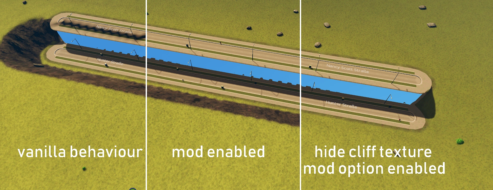

# RoadTextureTerrainEdgeRemover
Keeps terrain edge artifacts from showing on roads in Cities:Skylines. Also allows to hide the cliff texture globally.

### Background:
Networks using the RoadBase shader use the global terrain normal map instead of the normal map supplied by the asset.
When placing roads with different height too close together, this causes black artifacts.
This mod aims to eliminate those artifacts by supplying the RoadBase shader with a blank normal map.

### Details:
The global normal map is stored in the blue and alpha channels of `TerrainPatch::SurfaceMapA`.
It is generated in `TerrainPatch::Refresh` using the `TerrainManager`'s height data.

With the "hide cliff texture" setting disabled (default), this mod clones the SurfaceMapA texture after each run of `TerrainPatch::Refresh` and erases the clone's blue and alpha channels.
When NetNode and NetSegment try to access the `SurfaceMapA` via `TerrainManager::GetSurfaceMapping` the clone is returned instead.

With the "hide cliff texture" setting enabled, no clone is created, instead, the original `SurfaceMapA` is modified.